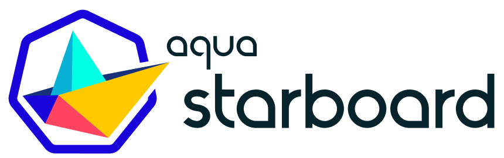
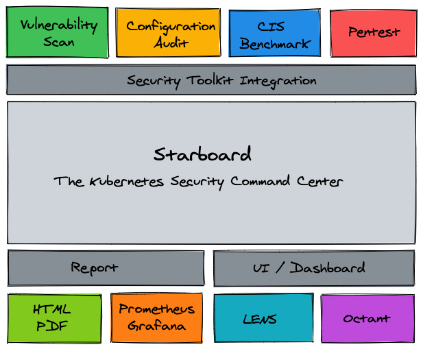

Welcome to Starboard!

In short, Starboard is a Kubernetes-native security toolkit.

This tutorial will focus on using the Starboard CLI.

You can find the details in the documentation.

Alternatively, Starboard also comes as Kubernetes Operator, which we explore in another tutorial:
* Katacoda Tutorial for the Starboard Operator
* Starboard Operator Documentation

## Overview

Starboard provides:

* Automated vulnerability scanning for Kubernetes workloads.
* Automated configuration audits for Kubernetes resources with predefined rules or custom Open Policy Agent (OPA) policies.
* Automated infrastructures scanning and compliance checks with CIS Benchmarks published by the Center for Internet Security (CIS).
* Penetration test results for a Kubernetes cluster.
* Custom Resource Definitions and a Go module to work with and integrate a range of security scanners.
* The Octant Plugin and the Lens Extension that make security reports available through familiar Kubernetes interfaces.

## About this scenario

This scenario will show you multiple ways to use the Starboard CLI for

* TODO

You will not need to install anything, everything is provided through Katacoda.

## Resources

* [Website]() -- Coming Soon!
* [GitHub](https://github.com/aquasecurity/starboard)
* [Documentation](https://aquasecurity.github.io/starboard/)

## Questions

If you have any questions, please join the [Aqua Slack channel](https://slack.aquasec.com/). 

