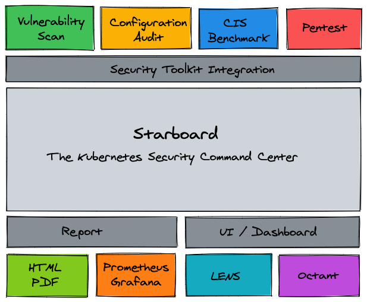

Welcome to Starboard!

In short, Starboard is a Kubernetes-native security toolkit.

This tutorial will focus on using the Starboard Operator inside your Kubernetes Cluster.
If you are new to Kubernetes Operators have a look at the [Kubernetes documentation.](https://kubernetes.io/docs/concepts/extend-kubernetes/operator/)

The Starboard operator, once installed, will monitor the workloads inside your Kubernetes cluster. Once it detects a new object, such as the pod of a deployment, it will initiate a vulnerability scan and configuration audit.
You can find more information in the [Starboard documentation.](https://aquasecurity.github.io/starboard/v0.14.1/operator/)

Alternatively, Starboard also comes as a CLI, which we explore in another tutorial:
* Katacoda Tutorial for the Starboard CLI
* Starboard CLI [Documentation](https://aquasecurity.github.io/starboard/v0.14.1/cli/)

## Overview

Starboard provides:

* Automated vulnerability scanning for Kubernetes workloads.
* Automated configuration audits for Kubernetes resources with predefined rules or custom Open Policy Agent (OPA) policies.
* Automated infrastructures scanning and compliance checks with CIS Benchmarks published by the Center for Internet Security (CIS).
* Penetration test results for a Kubernetes cluster.
* Custom Resource Definitions and a Go module to work with and integrate a range of security scanners.
* The Octant Plugin and the Lens Extension that make security reports available through familiar Kubernetes interfaces.

## About this scenario

This scenario will show you multiple ways to use the Starboard Operator. We are going to

* Deploy the Operator inside our Kubernetes Cluster
* Run VulnerabilityReports
* Run ConfigAuditReports 
* Eun CiskubebenchReports

You will not need to install anything locally or from an external website, everything is provided through Katacoda. However, you are encouraged to play around with with the example once the scenario is over.

## Resources

* [Website]() -- Coming Soon!
* [GitHub](https://github.com/aquasecurity/starboard)
* [Documentation](https://aquasecurity.github.io/starboard/)

## Questions

If you have any questions, please join the [Aqua Slack channel](https://slack.aquasec.com/). 

