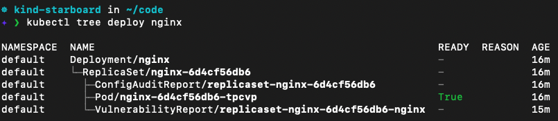

# Create Deployment

To allow the operator to scan workloads inside our Kubernetes cluster, we have to create a deployment.

With the following command, we install an nginx deployment that we know has vulnerbilities:

```
kubectl create deployment nginx --image nginx:1.16
```{{execute}}

Make sure nginx is installed:

```
kubectl get all
```{{execute}}

When the first ReplicaSet controlled by the nginx Deployment is created, the operator immediately detects that and creates the Kubernetes Job in the starboard-system namespace to scan the nginx:1.16 image for vulnerabilities. It also creates the Job to audit the Deployment's configuration for common pitfalls such as running the nginx container as root. We can view the job with the following command:

```
kubectl get job -n starboard-system
```{{execute}}

Note that you will likely not see the job when it runs and the namespace will appear as empty.

Once the job is finished, it will be deleted and a vulnerability report will have been saved into the namespace of our deployment. The report will be named after the ReplicaSet of the Deployment.
A separate VulnerabilityReport will be saved for each pod referenced in the Replicaset that is scanned.

We can view the VulnerabilityReports with the following command:

```
kubectl get vulnerabilityreports -o wide
```{{execute}}

Similarly, the operator creates a ConfigAuditReport holding the result of auditing the configuration of the active ReplicaSet controlled by the nginx Deployment:

```
kubectl get configauditreports -o wide
```{{execute}}

Note that you will only see reports if the job is still in progress.

The reports are attached to the nginx deployment. We can view the depencies through the kubectl tree plugin:

```
kubectl tree deploy nginx
```

It is not installed in our environment but this would be the output:




This has several benefits, including:
* When the nginx deployment is updated, it will have the Reports missing, thus, Starboard will generate new reports for the new deployment
* When a deployment is deleted, all reports connected to that deployment are also deleted. Thus, we do not have reports in our cluster that are not connected to an existing deployment.

Try to update the deployment:

```
kubectl set image deployment nginx nginx=nginx:1.17
```{{execute}}

And look at the reports again:

```
kubectl get configauditreports -o wide
```{{execute}}