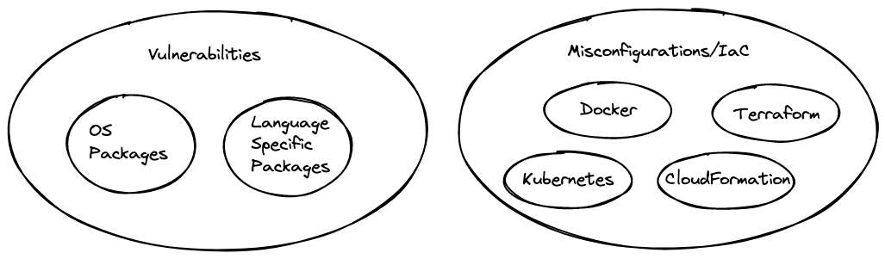
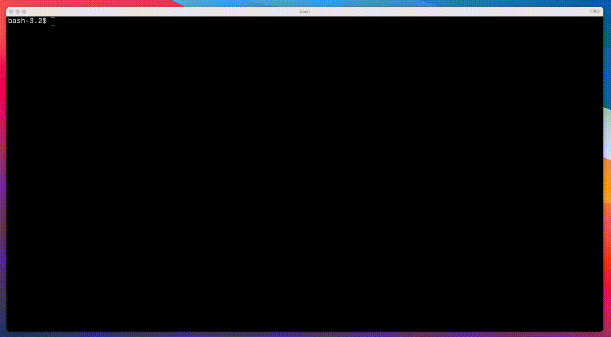

Welcome to Trivy!

## Overview

`Trivy` (`tri` pronounced like **tri**gger, `vy` pronounced like en**vy**) is a simple and comprehensive scanner for vulnerabilities in container images, file systems, and Git repositories, as well as for configuration issues.
`Trivy` detects vulnerabilities of OS packages (Alpine, RHEL, CentOS, etc.) and language-specific packages (Bundler, Composer, npm, yarn, etc.).
In addition, `Trivy` scans Infrastructure as Code (IaC) files such as Terraform, Dockerfile and Kubernetes, to detect potential configuration issues that expose your deployments to the risk of attack.
`Trivy` is easy to use. Just install the binary and you're ready to scan.

## About this scenario

This scenario will show you multiple ways to use Trivy for

* Scanning for vulnerabilities
* Infrastructure as Code scans

You will not need to install anything, everything is provided through Katacoda.

## Resources

* [Website]() -- Coming Soon!
* [GitHub](https://github.com/aquasecurity/trivy)
* [Documentation](https://aquasecurity.github.io/trivy/)

## Questions

If you have any questions, please join the [Aqua Slack channel](https://slack.aquasec.com/). 

## Use Cases

Scanning for Vulnerabilities in:
* Container Images
* Git Repositories
* Root Filesystem
* Language Specific Files

Scanning for Misconfigurations in:
* Kubernetes YAML Manifests
* Dockerfile
* Infrastructure as Code (IaC) configuration such as Terraform
 

