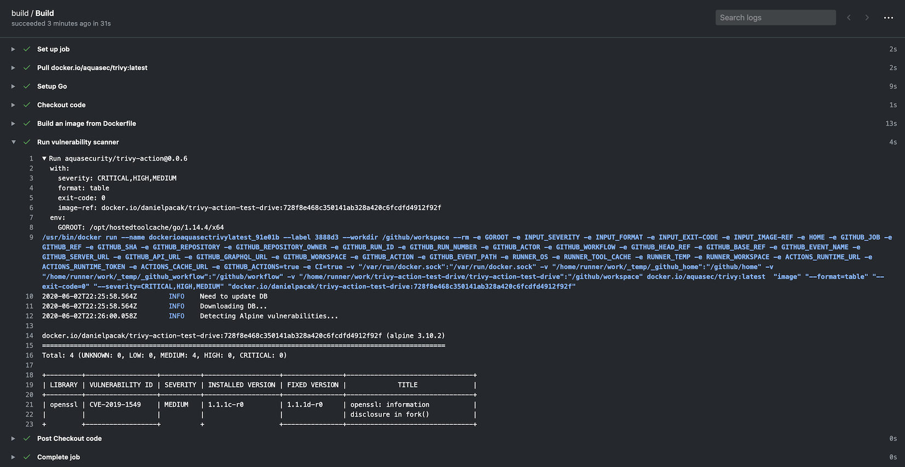

# Vulnerability Scanning

Trivy can do two main things, checking for vulnerabilities and for misconfigurations. In this example, we are going to get started with vulnerability scanning.

### Image Scanning

If you are using containers, it is very likely that you are using other people's images form container registies.

For example, we can find node images on the Docker Hub: 

To check a container image for vulnerabilities, we can run:

```
trivy image [CONTAINER_IMAGE_NAME]
```

Check a container image for vulnerabilities:

```
trivy image node:17.4.0-alpine
```{{execute}}

## Run your own container image

As long as your container image is on a public registry such as the Docker Hub.

**TASK**: Copy the command below and add your own container image at the end:

```
trivy image [CONTAINER_IMAGE_NAME]
```{{copy}}

Try it out! This is a demo environment so nothing can go wrong.

## Additional flags 

You can pass in additional flags depending on your needs:

```
trivy image --help
```{{execute}}

For example, you could only display the critical vulnerabilities:

```
trivy image --severity HIGH,CRITICAL node:17.4.0-alpine
```{{execute}}

Or only display vulnerabilities that already have a fix available but that did not get implemented in the image:

```
trivy image --ignore-unfixed node:17.4.0-alpine
```{{execute}}

## CI/CD Pipelines

Creating and maintaining continuos integration and delivery pipelines are a core part of the work of every DevOps Engineer. 

In most CI/CD pipelines, you would build the container image -- Thus, this is the perfect place to check for vulnerabilities in your repository but also of any dependencies.

The [Trivy docs]() has lots of examples on integrating Trivy into CI/CD pipelines.

e.g. below is the example for GitHub Action that you can find in the following repository: https://github.com/aquasecurity/trivy-action


